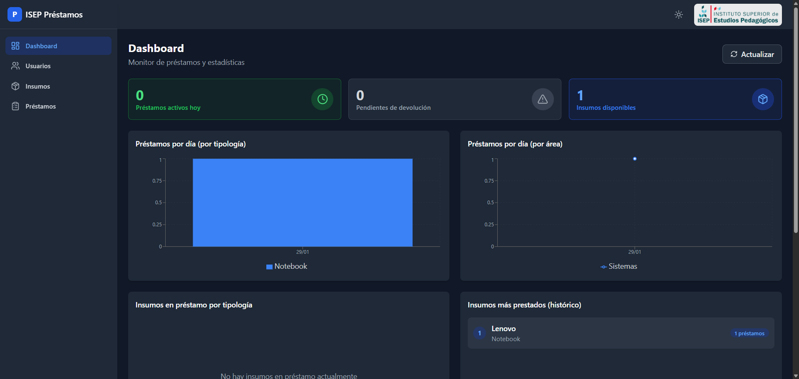
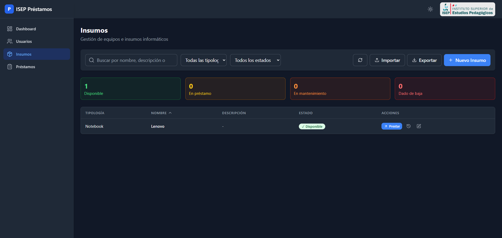
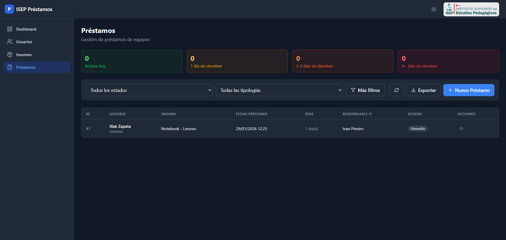

# Sistema de Gestión de Préstamos de Equipos Informáticos

**ISEP - Instituto Superior de Estudios Pedagógicos, Córdoba, Argentina**

Sistema web para gestionar préstamos de equipos informáticos (notebooks, periféricos, etc.) con control de devoluciones, alertas visuales y estadísticas.

## Características Principales

- **Gestión de Usuarios**: CRUD completo con roles (usuario y soporte_it)
  - Selector de área/equipo con opciones desde la base de datos
  - Posibilidad de agregar nuevas áreas personalizadas
- **Gestión de Insumos**: Inventario de equipos con estados (Disponible, En préstamo, En mantenimiento, Dado de baja)
  - Estadísticas por estado con filtros rápidos
  - Historial de préstamos por equipo
- **Sistema de Préstamos**:
  - Flujos rápidos de préstamo/devolución desde listado de insumos (2 clics)
  - Alertas visuales por días transcurridos sin devolución
  - Selector de responsable IT
- **Dashboard Simplificado**:
  - 3 métricas principales: Activos hoy, Pendientes de devolución, Insumos disponibles
  - 6 gráficos: Préstamos por día (tipología), Préstamos por día (área), Distribución por tipología, Insumos más prestados, Usuarios con más préstamos activos, Préstamos más antiguos
- **Tema Oscuro/Claro**: Toggle de tema con preferencia guardada en localStorage (oscuro por defecto)
- **Branding ISEP**: Logo del instituto en el encabezado
- **Importación/Exportación CSV** para usuarios e insumos
- **Dockerizado**: Despliegue con un solo comando

## Stack Tecnológico

- **Frontend**: React 18 + Tailwind CSS + Recharts
- **Backend**: Node.js + Express
- **Base de datos**: SQLite (better-sqlite3)
- **Containerización**: Docker + Docker Compose

## Instalación y Ejecución

### Opción 1: Docker (Recomendado)

```bash
# Clonar el repositorio
git clone <repo-url>
cd prestamos-soporte-isep-v2

# Construir y ejecutar
docker-compose up --build

# Acceder a la aplicación
# http://localhost:3000
```

### Opción 2: Desarrollo Local

```bash
# Backend
cd backend
npm install
node seed.js  # Opcional: cargar datos de ejemplo
npm run dev

# Frontend (en otra terminal)
cd frontend
npm install
npm run dev
```

## Estructura del Proyecto

```
prestamos-soporte-isep-v2/
├── backend/
│   ├── app.js              # Punto de entrada
│   ├── database.js         # Configuración SQLite
│   ├── seed.js             # Datos de ejemplo
│   ├── routes/
│   │   ├── usuarios.js     # API de usuarios
│   │   ├── insumos.js      # API de insumos
│   │   ├── prestamos.js    # API de préstamos
│   │   └── dashboard.js    # API de métricas
│   └── utils/
│       └── helpers.js      # Funciones auxiliares
├── frontend/
│   ├── src/
│   │   ├── components/     # Componentes React
│   │   ├── pages/          # Páginas principales
│   │   ├── services/       # Llamadas a API
│   │   └── utils/          # Funciones auxiliares
│   └── ...
├── Dockerfile
├── docker-compose.yml
└── README.md
```

## Base de Datos

### Tabla: usuarios

| Campo | Tipo | Descripción |
|-------|------|-------------|
| id | INTEGER | PK autoincremental |
| mail | TEXT | Email único |
| nombre | TEXT | Nombre |
| apellido | TEXT | Apellido |
| dni | TEXT | DNI único |
| area_equipo | TEXT | Área/departamento |
| rol | TEXT | 'usuario' o 'soporte_it' |
| activo | BOOLEAN | Soft delete |

### Tabla: insumos

| Campo | Tipo | Descripción |
|-------|------|-------------|
| id | INTEGER | PK autoincremental |
| tipologia | TEXT | Tipo (Notebook, Mouse, etc.) |
| nombre | TEXT | Nombre descriptivo |
| descripcion | TEXT | Características |
| numero_serie | TEXT | Número de serie único |
| estado | TEXT | Disponible/En préstamo/En mantenimiento/Dado de baja |
| observaciones | TEXT | Notas |

### Tabla: prestamos

| Campo | Tipo | Descripción |
|-------|------|-------------|
| id | INTEGER | PK autoincremental |
| usuario_id | INTEGER | FK a usuarios |
| insumo_id | INTEGER | FK a insumos |
| usuario_it_id | INTEGER | FK a usuarios (soporte_it) |
| fecha_hora_prestamo | DATETIME | Fecha del préstamo |
| fecha_hora_devolucion_real | DATETIME | Fecha de devolución |
| estado | TEXT | Activo/Devuelto |
| observaciones_prestamo | TEXT | Notas del préstamo |
| observaciones_devolucion | TEXT | Notas de devolución |

## Formato CSV para Importación

### Usuarios
```csv
mail,nombre,apellido,dni,area_equipo,rol
juan.perez@isep.edu.ar,Juan,Pérez,12345678,Administración,usuario
carlos.it@isep.edu.ar,Carlos,García,23456789,Soporte IT,soporte_it
```

### Insumos
```csv
tipologia,nombre,descripcion,numero_serie,observaciones
Notebook,Lenovo ThinkPad T14,Intel i5 8GB RAM,LNV-001,
Mouse,Logitech M185,Inalámbrico,,
```

## Sistema de Roles

- **usuario**: Puede recibir préstamos de equipos
- **soporte_it**: Puede gestionar préstamos (aparece como responsable IT en el selector)

Un usuario con rol `soporte_it` también puede recibir préstamos.

## Sistema de Alertas

Los préstamos activos muestran alertas visuales según los días transcurridos:

| Días | Color | Alerta |
|------|-------|--------|
| 0 | Verde | Activo hoy |
| 1 | Amarillo | Advertencia |
| 2-3 | Naranja | Alerta |
| 4+ | Rojo | Crítico |

## API Endpoints

### Usuarios
- `GET /api/usuarios` - Listar (con filtros y paginación)
- `POST /api/usuarios` - Crear
- `PUT /api/usuarios/:id` - Actualizar
- `DELETE /api/usuarios/:id` - Desactivar (soft delete)
- `PUT /api/usuarios/:id/restore` - Restaurar usuario desactivado
- `GET /api/usuarios/soporte-it` - Listar solo soporte IT
- `GET /api/usuarios/areas` - Listar áreas/equipos únicos
- `POST /api/usuarios/import` - Importar CSV
- `GET /api/usuarios/export` - Exportar CSV

### Insumos
- `GET /api/insumos` - Listar (con filtros y paginación)
- `POST /api/insumos` - Crear
- `PUT /api/insumos/:id` - Actualizar
- `DELETE /api/insumos/:id` - Eliminar
- `GET /api/insumos/:id/historial` - Historial de préstamos
- `GET /api/insumos/:id/prestamo-activo` - Préstamo activo actual
- `GET /api/insumos/tipologias` - Listar tipologías únicas
- `GET /api/insumos/estados` - Listar estados posibles
- `POST /api/insumos/import` - Importar CSV
- `GET /api/insumos/export` - Exportar CSV

### Préstamos
- `GET /api/prestamos` - Listar (con filtros y paginación)
- `POST /api/prestamos` - Crear préstamo
- `PUT /api/prestamos/:id` - Actualizar (solo activos)
- `PUT /api/prestamos/:id/devolver` - Registrar devolución
- `GET /api/prestamos/export` - Exportar CSV

### Dashboard
- `GET /api/dashboard/metricas` - Métricas principales (activos hoy, pendientes, desglose por días)
- `GET /api/dashboard/graficos` - Datos para gráficos (préstamos por día/tipo/área, distribución, usuarios pendientes)
- `GET /api/dashboard/prestamos-criticos` - Préstamos con 4+ días sin devolver
- `GET /api/dashboard/prestamos-antiguos` - Top préstamos más antiguos

## Capturas de Pantalla

### Dashboard


### Listado de Insumos con Acciones Rápidas


### Modal de Préstamo Rápido


## Licencia

MIT License - ISEP Córdoba, Argentina 2026
